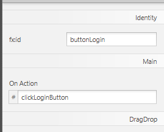
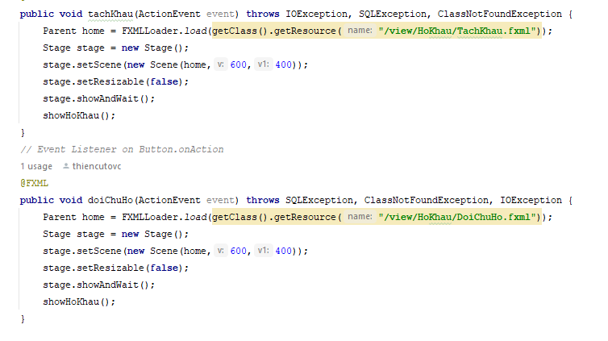
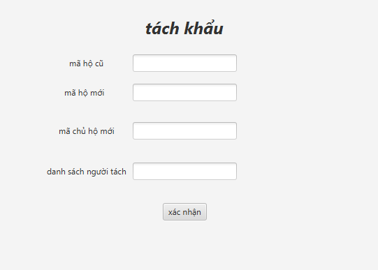
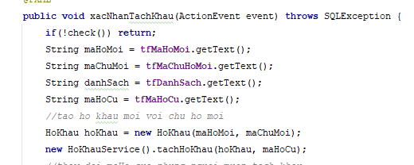
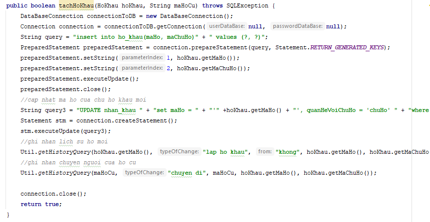

# QuanLyHoKhauNhanKhau
<h2>Bài Tập Lớn Môn Công Nghệ Phần Mềm</h2>
phần này t sẽ thêm các chức năng về nhân khẩu 
thiedzvc
<h2>trình tự tạo một khối chức năng mới:</h2>
<h3>1, tạo view và controller cho khối chức năng</h3>
-Tạo view trong scenebuilder, tạo một tableview để hiện danh sách hiện tại trong database 
-Gắn các id cho tableview và gắn các method cho các button 
 
-generate controller theo view vừa tạo 
-controller lớn này dùng để ủy nhiệm chức năng cho một khối M-V-C nhỏ khác, sau khi click vào nút(etc tachkhau), controller đưa đến view tách khẩu 
 
<h3>2, tạo view - controller - model&service phục vụ từng nhiệm vụ như thêm/sửa/xóa</h3>
-view: một form đơn giản với mục đích lấy dữ liệu nhập  

-controller: lấy dữ liệu từ view, valid data, gọi đến service để thao tác database 
 
-service & model: nhận yêu cầu và dữ liệu người dùng từ controller, thực hiện thao tác với database: 
 
<h4>ps: người lớn không có quyền lựa chọn, vì vậy ta sẽ yêu cả hai nàng</h4>
